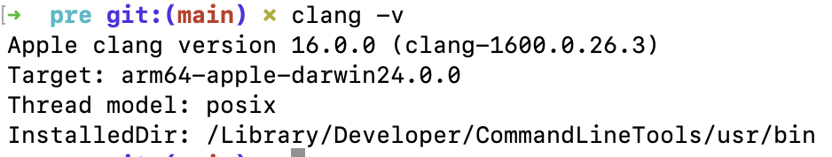
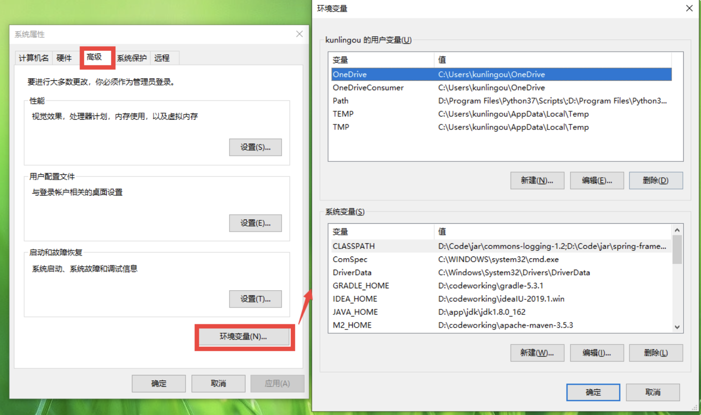
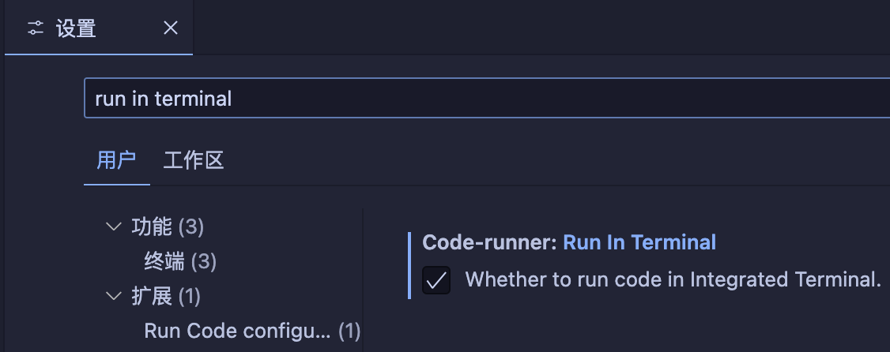

# 计算机程序设计 A 上机环境配置

[TOC]

本文档位于 github 仓库 [https://github.com/rewinery/USTC-ComputerProgrammingA-2024Fall](https://github.com/rewinery/USTC-ComputerProgrammingA-2024Fall)中

## 编译器

### Mac OS

对于使用 MacBook 的同学，可以使用终端 (位于`其他`里，如果找不到可以用 `command+space` 组合键搜索)

在终端中输入：`xcode-select --install`

然后输入 `clang -v`，如果输出类似下列版本信息即安装成功

> 另外推荐同学们安装 `homebrew`

### Windows

推荐使用 `MinGW`，下载地址：[MinGW](https://sourceforge.net/projects/mingw/files/)，点击下图中的 `Download Latest Version` 即可下载

而后打开`mingw-get-setup.exe` 安装包进入如下界面，选择 install

你会看到下图所示的界面：

虽然 MinGW 很小，但是还是建议大家养成不安装在 C 盘的好习惯，自己选取一个路径，请记住这个路径，下面用 `$PATH` 表示你选定的安装路径。

待安装成功之后（大约耗时 1h），打开系统环境变量：按下 `Win+R`，输入 `sysdm.cpl`

切换到此标签页

在用户变量中选择 `Path`，点编辑，而后新建一条 `$PATH/bin` 的路径即可

最后重启电脑，通过 `Win+R` 输入 `powershell` 后打开 powershell 再键入 `gcc -v`，如果输出版本信息即安装成功

## 代码编辑器

### Xcode

适用于使用 MacOS 的同学

App Store 即可下载

### Visual Studio Code

推荐前往[官网](https://code.visualstudio.com)下载，如果下载速度偏慢可以自行搜索国内源下载

推荐配置：

1. 在**拓展**中下载 `Chinese`，英语好的同学可以不用
   
2. 在**拓展**中下载 `code runner`，从而能够通过 `control+option+N`（Windows 系统通过 `Ctrl+Alt+N`） 一键运行代码
   
3. 前往**设置**勾选 `run in terminal`，从而使你的程序能够输入
   

