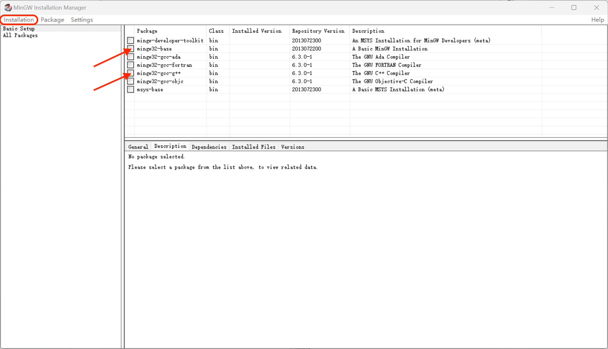

# 计算机程序设计 A 上机环境配置

[TOC]

本文档位于 github 仓库 [https://github.com/rewinery/USTC-ComputerProgrammingA-2024Fall](https://github.com/rewinery/USTC-ComputerProgrammingA-2024Fall)中

如果不想折腾的同学可以跳过本文档，下载 Dev-C++，选择什么编辑器和编译器不受限制，同学们可根据喜好自行选择，本文旨在为不知道该做什么的同学们一个引导。如果觉得本文对你有帮助，不妨为我的仓库点一个 star。

> **编译器**（compiler）是一种[计算机程序](https://zh.wikipedia.org/wiki/電腦程式)，它会将某种编程语言写成的[源代码](https://zh.wikipedia.org/wiki/原始碼)（原始语言）转换成另一种编程语言（目标语言）。
>
> 它主要的目的是将便于人编写、阅读、维护的高级计算机语言所写作的[源代码](https://zh.wikipedia.org/wiki/原始碼)程序，翻译为计算机能解读、运行的低阶机器语言的程序，也就是[可执行文件](https://zh.wikipedia.org/wiki/執行檔)。编译器将原始程序（source program）作为输入，翻译产生使用目标语言（target language）的等价程序。[源代码](https://zh.wikipedia.org/wiki/源代码)一般为高级语言（High-level language），如Pascal、C、C++、C# 、Java等，而目标语言则是汇编语言或目标机器的目标代码（Object code），有时也称作[机器代码](https://zh.wikipedia.org/wiki/机器代码)（Machine code）。
>
> 一个现代编译器的主要工作流程如下：
>
> [源代码](https://zh.wikipedia.org/wiki/源代码)（source code）→ [预处理器](https://zh.wikipedia.org/wiki/预处理器)（preprocessor）→ 编译器（compiler）→ [汇编程序](https://zh.wikipedia.org/wiki/汇编程序)（assembler）→ [目标代码](https://zh.wikipedia.org/wiki/目标代码)（object code）→ [链接器](https://zh.wikipedia.org/wiki/链接器)（linker）→ [可执行文件](https://zh.wikipedia.org/wiki/執行檔)（executables），最后打包好的文件就可以给电脑去判读执行了。

编辑器只是一个文本编辑器而已，所谓 Visual Studio Code 不过是封装了一些功能，其实调用的是系统内已经注册了的编译器，让你觉得是 Visual Studio Code 在编译代码，其实并非如此，只安装 Visual Studio Code 根本没法编译运行代码。

## 编译器

### Mac OS

对于使用 MacBook 的同学，可以使用终端 (位于`其他`里，如果找不到可以用 `command+space` 组合键搜索)

在终端中输入：`xcode-select --install`

然后输入 `clang -v`，如果输出类似下列版本信息即安装成功

> 另外推荐同学们安装 `homebrew`

### Windows

推荐使用 `MinGW`，下载地址：[MinGW](https://sourceforge.net/projects/mingw/files/)，点击下图中的 `Download Latest Version` 即可下载

而后打开`mingw-get-setup.exe` 安装包进入如下界面，选择 install

你会看到下图所示的界面：

虽然 MinGW 很小，但是还是建议大家养成不安装在 C 盘的好习惯，自己选取一个路径，请记住这个路径，下面用 `$PATH` 表示你选定的安装路径。

需要安装的部分有如下两个：勾选之后再点击 `installation` 里的 `apply changes` 便会开始下载

待下载完成之后（大约耗时 1h），打开系统环境变量：按下 `Win+R`，输入 `sysdm.cpl`

切换到此标签页

在用户变量中选择 `Path`，点编辑，而后新建一条 `$PATH/bin` 的路径即可（命名建议为 `MinGW`，不过不重要）

最后重启电脑，通过 `Win+R` 输入 `powershell` 后打开 powershell 再键入 `gcc -v`，如果输出版本信息即安装成功

### WSL/Linux

使用 Windows 的同学可以安装 wsl 来使用 （略）

而后只需要在 shell 中输入 `sudo apt install build-essentials`，即可

## 代码编辑器

### Xcode

适用于使用 MacOS 的同学

App Store 即可下载

### Visual Studio Code

推荐前往[官网](https://code.visualstudio.com)下载，如果下载速度偏慢可以自行搜索国内源下载

推荐配置：

1. 在**拓展**中下载 `Chinese`，英语好的同学可以不用
   
2. 在**拓展**中下载 `code runner`，从而能够通过 `control+option+N`（Windows 系统通过 `Ctrl+Alt+N`） 一键运行代码
   
3. 前往**设置**勾选 `run in terminal`，从而使你的程序能够输入
   

### vim

### Clion

